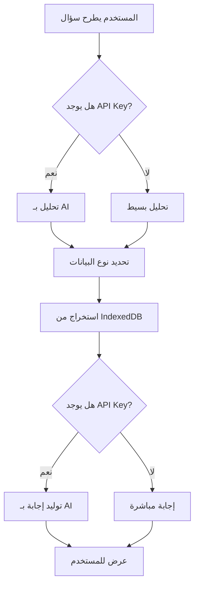

# 🤖 المساعد الذكي لنقطة البيع - AI POS Assistant

## 📋 نظرة عامة

المساعد الذكي هو ميزة متطورة تم إضافتها لنظام نقطة البيع تتيح للمدير التحدث بشكل طبيعي مع النظام واستخراج البيانات والإحصائيات من قاعدة البيانات المحلية **بدون الحاجة للإنترنت**.

---

## ✨ المميزات الرئيسية

### 1️⃣ **العمل بدون إنترنت**
- يعمل بالكامل مع البيانات المحلية (IndexedDB)
- لا يحتاج اتصال بالإنترنت لاستخراج البيانات
- استجابة فورية وسريعة

### 2️⃣ **واجهة محادثة طبيعية**
- شات بوت تفاعلي داخل النظام
- دعم اللغة العربية بشكل كامل
- أسئلة شائعة جاهزة للاستخدام السريع

### 3️⃣ **تحليل ذكي للأسئلة**
- فهم الأسئلة بلغة طبيعية
- تحليل ذكي يعمل حتى بدون AI (fallback)
- استخراج البيانات المناسبة تلقائياً

### 4️⃣ **إحصائيات شاملة**
- 📊 مبيعات اليوم / الأمس / الأسبوع / الشهر
- 💰 الأرباح والإيرادات
- 📈 أكثر المنتجات مبيعاً
- 📦 حالة المخزون
- 💳 إحصائيات طرق الدفع

---

## 🗂️ البنية التقنية

### **الملفات الرئيسية:**

```
src/
├── services/
│   ├── LocalAnalyticsService.ts   # خدمة استخراج البيانات المحلية
│   └── AIAssistantService.ts      # خدمة معالجة AI والتحليل
├── components/
│   └── pos/
│       ├── AIAssistant.tsx         # واجهة الشات بوت
│       ├── AIAssistantButton.tsx   # زر المساعد (عائم/header)
│       └── index.ts                # ملف التصدير
└── pages/
    └── POSAdvanced.tsx             # صفحة POS مع المساعد
```

---

## 🎯 كيفية الاستخدام

### **1. الوصول للمساعد الذكي**

هناك طريقتان للوصول:

#### **أ) الزر العائم:**
- زر دائري أزرق في أسفل يسار الشاشة
- يظهر في جميع صفحات POS
- مع أنيميشن نبضي جذاب

#### **ب) من الـ Header:**
- زر "المساعد الذكي" في أعلى صفحة POS
- متاح بجانب مؤشر الحالة

### **2. طرح الأسئلة**

يمكنك سؤال المساعد بلغة طبيعية:

```
✅ أمثلة على الأسئلة المدعومة:

📊 المبيعات:
- "كم بلغت مبيعات اليوم؟"
- "ما كانت مبيعات الأمس؟"
- "أعطني مبيعات هذا الأسبوع"
- "كم بعنا هذا الشهر؟"

💰 الأرباح:
- "كم الفائدة اليوم؟"
- "ما هي أرباح الأمس؟"
- "أعطني إجمالي الأرباح للأسبوع"

📈 المنتجات:
- "ما أكثر منتج تم بيعه؟"
- "أكثر 5 منتجات مبيعاً هذا الأسبوع"
- "ما هي المنتجات الأكثر مبيعاً؟"

📦 المخزون:
- "ما حالة المخزون؟"
- "كم منتج نفد من المخزون؟"
- "أعطني إحصائيات المخزون"

💳 طرق الدفع:
- "ما هي طرق الدفع الأكثر استخداماً؟"
- "إحصائيات المدفوعات"

📋 نظرة عامة:
- "أعطني نظرة عامة"
- "إحصائيات عامة"
```

---

## 🔧 الإعداد والتكوين

### **المتطلبات الأساسية:**

1. **قاعدة البيانات المحلية:**
   - يجب أن تكون هناك بيانات في IndexedDB
   - الجداول المطلوبة: `posOrders`, `posOrderItems`, `products`

2. **API Key (اختياري):**
   - للحصول على إجابات أكثر طبيعية باستخدام AI
   - بدونه سيعمل المساعد بنظام fallback بسيط

### **إضافة API Key:**

1. احصل على مفتاح من [OpenRouter](https://openrouter.ai/keys)

2. أضفه لملف `.env`:
```env
VITE_OPENROUTER_API_KEY=sk-or-v1-your-api-key-here
```

3. أعد تشغيل التطبيق

---

## 🧠 كيف يعمل المساعد؟

### **سير العمل:**



### **1. تحليل السؤال (analyzeQuery)**

```typescript
// مع AI:
- إرسال السؤال لـ OpenRouter
- تحديد نوع البيانات المطلوبة
- استخراج المعاملات (timeframe, dates, etc)

// بدون AI (fallback):
- تحليل بسيط بالكلمات المفتاحية
- مطابقة الأنماط الشائعة
```

### **2. استخراج البيانات (fetchRelevantData)**

```typescript
// من LocalAnalyticsService:
- getSalesByDate() - مبيعات يوم معين
- getTodaySales() - مبيعات اليوم
- getTopSellingProducts() - أكثر مبيعاً
- getInventoryStats() - حالة المخزون
- getPaymentMethodStats() - طرق الدفع
```

### **3. توليد الإجابة (generateAnswer)**

```typescript
// مع AI:
- إرسال السؤال + البيانات لـ AI
- الحصول على إجابة طبيعية ومنسقة

// بدون AI:
- تنسيق البيانات بشكل بسيط
- إضافة إيموجي مناسبة
```

---

## 📊 البيانات المتاحة

### **LocalAnalyticsService Methods:**

| الدالة | الوصف | البيانات المرجعة |
|--------|-------|------------------|
| `getSalesByDate(date)` | مبيعات يوم معين | totalSales, orderCount, profit, orders[] |
| `getTodaySales()` | مبيعات اليوم | نفس الأعلى |
| `getYesterdaySales()` | مبيعات الأمس | نفس الأعلى |
| `getWeeklySales()` | مبيعات الأسبوع | totalSales, orderCount, profit, dailyBreakdown[] |
| `getSalesStats(days)` | إحصائيات فترة | totalSales, totalOrders, averageOrderValue, totalProfit, bestDay |
| `getTopSellingProducts(days)` | أكثر مبيعاً | productId, productName, quantitySold, totalRevenue |
| `getInventoryStats()` | حالة المخزون | totalProducts, lowStockProducts, outOfStockProducts, totalStockValue |
| `getPaymentMethodStats(days)` | طرق الدفع | method, count, totalAmount |

---

## 🎨 التخصيص

### **تخصيص الأسئلة الشائعة:**

في `AIAssistant.tsx`:

```typescript
const SUGGESTED_QUESTIONS = [
  { icon: Calendar, text: 'كم بلغت مبيعات الأمس؟', color: 'text-blue-600' },
  { icon: TrendingUp, text: 'ما أكثر منتج تم بيعه؟', color: 'text-green-600' },
  // أضف المزيد هنا...
];
```

### **تخصيص نسبة الأرباح:**

في `LocalAnalyticsService.ts`:

```typescript
// حالياً: 30% من المبيعات
const profit = totalSales * 0.3;

// يمكنك تغييرها حسب هامش الربح الحقيقي
const profit = totalSales * 0.25; // 25%
```

### **تخصيص الألوان:**

في `AIAssistantButton.tsx`:

```typescript
// الزر العائم
className="bg-gradient-to-br from-primary via-primary/90 to-primary/80"

// يمكنك تغيير الألوان
className="bg-gradient-to-br from-purple-500 via-purple-600 to-purple-700"
```

---

## 🚀 التحسينات المستقبلية

### **قريباً:**

- [ ] دعم الرسوم البيانية في الإجابات
- [ ] إمكانية تصدير البيانات من المحادثة
- [ ] حفظ سجل المحادثات
- [ ] اقتراحات ذكية بناءً على البيانات
- [ ] تنبيهات تلقائية (مخزون منخفض، مبيعات ضعيفة، إلخ)
- [ ] دعم الأوامر الصوتية
- [ ] تكامل مع تقارير مفصلة

---

## 🐛 استكشاف الأخطاء

### **المشكلة: "Cannot read properties of undefined (reading 'toArray')"**

**الحل:**
```typescript
// تأكد من أن أسماء الجداول صحيحة:
inventoryDB.posOrders ✅  (ليس pos_orders ❌)
inventoryDB.posOrderItems ✅  (ليس pos_order_items ❌)
```

### **المشكلة: "API error: 401 Unauthorized"**

**الحل:**
```bash
# 1. تأكد من إضافة API Key في .env
VITE_OPENROUTER_API_KEY=your-key-here

# 2. أو اتركه فارغاً للعمل بدون AI
# المساعد سيعمل بنظام fallback تلقائياً
```

### **المشكلة: "لا توجد بيانات"**

**الحل:**
1. تأكد من وجود طلبات في قاعدة البيانات المحلية
2. افتح DevTools > Application > IndexedDB > bazaarDB_v2
3. تحقق من الجداول: posOrders, posOrderItems, products

---

## 📝 ملاحظات هامة

### **⚠️ الأمان:**

1. **API Key:**
   - لا تضع API Key مباشرة في الكود
   - استخدم متغيرات البيئة دائماً
   - لا ترفع ملف `.env` على Git

2. **البيانات المحلية:**
   - جميع البيانات محفوظة محلياً
   - لا يتم إرسال أي بيانات حساسة للـ AI
   - فقط الأسئلة والإحصائيات العامة

### **💡 نصائح الأداء:**

1. **حجم البيانات:**
   - المساعد يقرأ جميع الطلبات من IndexedDB
   - للأداء الأفضل، نظف البيانات القديمة دورياً

2. **Cache:**
   - يمكن إضافة caching للاستعلامات المتكررة
   - حالياً كل استعلام يقرأ من DB مباشرة

---

## 📞 الدعم

إذا واجهت أي مشكلة:

1. تحقق من console للأخطاء
2. راجع قسم استكشاف الأخطاء أعلاه
3. تأكد من صحة البيانات في IndexedDB
4. جرب بدون API Key (fallback mode)

---

## 🎉 الخلاصة

المساعد الذكي يوفر:

✅ **سهولة الاستخدام** - محادثة طبيعية بالعربية  
✅ **سرعة الاستجابة** - بيانات محلية فورية  
✅ **العمل بدون إنترنت** - لا حاجة للاتصال  
✅ **مرونة عالية** - يعمل مع أو بدون AI  
✅ **واجهة جميلة** - تصميم عصري ومتجاوب  

**استمتع باستخدام المساعد الذكي! 🤖✨**
