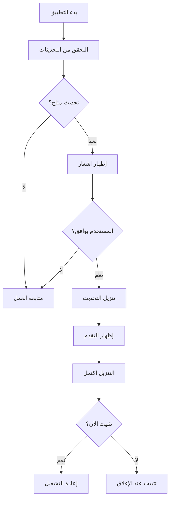

# 🚀 دليل نظام التحديث التلقائي لتطبيق Stockiha Electron

## 📋 المحتويات
1. [نظرة عامة](#نظرة-عامة)
2. [آلية العمل](#آلية-العمل)
3. [الملفات المنشأة](#الملفات-المنشأة)
4. [إعداد GitHub Releases](#إعداد-github-releases)
5. [كيفية النشر](#كيفية-النشر)
6. [الاختبار](#الاختبار)
7. [استكشاف الأخطاء](#استكشاف-الأخطاء)

---

## 🎯 نظرة عامة

تم تطبيق نظام تحديث تلقائي متقدم باستخدام **electron-updater** يسمح بـ:
- ✅ التحقق التلقائي من التحديثات كل 4 ساعات
- ✅ إشعار المستخدم بالتحديثات الجديدة
- ✅ تنزيل التحديثات في الخلفية
- ✅ تثبيت تلقائي عند إعادة التشغيل
- ✅ بدون حذف التطبيق أو فقدان البيانات

---

## 🔄 آلية العمل

### المراحل الأساسية:



### التدفق التفصيلي:

1. **عند بدء التطبيق:**
   - ينتظر 3 ثواني
   - يتحقق من التحديثات تلقائياً

2. **التحقق الدوري:**
   - كل 4 ساعات يتحقق من التحديثات
   - بدون إزعاج المستخدم

3. **عند وجود تحديث:**
   - يظهر نافذة حوار
   - خياران: تنزيل الآن أو لاحقاً

4. **أثناء التنزيل:**
   - يعرض شريط التقدم
   - السرعة والحجم
   - النسبة المئوية

5. **بعد التنزيل:**
   - يظهر إشعار بجاهزية التحديث
   - خياران: تثبيت الآن أو عند الإغلاق

---

## 📁 الملفات المنشأة

### 1. **electron/updater.cjs**
نظام إدارة التحديثات الأساسي.

**المسؤوليات:**
- التحقق من التحديثات
- تنزيل التحديثات
- تثبيت التحديثات
- إدارة الأحداث

**الوظائف الرئيسية:**
```javascript
- initialize(mainWindow)        // تهيئة النظام
- checkForUpdates(silent)       // التحقق من التحديثات
- downloadUpdate()              // تنزيل التحديث
- quitAndInstall()              // تثبيت وإعادة التشغيل
```

### 2. **electron/main.cjs** (المحدث)
تم إضافة:
- Import للـ updater
- تهيئة النظام عند البدء
- IPC handlers للتواصل مع Frontend
- تنظيف الموارد عند الإغلاق

**IPC Handlers المضافة:**
```javascript
- updater:check-for-updates     // التحقق يدوياً
- updater:download-update       // بدء التنزيل
- updater:quit-and-install      // التثبيت الفوري
- updater:get-version           // الإصدار الحالي
```

### 3. **electron/preload.cjs** (المحدث)
تم إضافة `window.electronAPI.updater`:
```javascript
{
  checkForUpdates()             // دالة التحقق
  downloadUpdate()              // دالة التنزيل
  quitAndInstall()              // دالة التثبيت
  getVersion()                  // جلب الإصدار
  onCheckingForUpdate()         // حدث التحقق
  onUpdateAvailable()           // حدث توفر تحديث
  onUpdateNotAvailable()        // حدث عدم التوفر
  onDownloadProgress()          // حدث التقدم
  onUpdateDownloaded()          // حدث اكتمال التنزيل
  onUpdateError()               // حدث الخطأ
}
```

### 4. **src/pages/UpdatesPage.tsx**
صفحة واجهة المستخدم الكاملة.

**الميزات:**
- ✅ عرض الإصدار الحالي
- ✅ زر التحقق من التحديثات
- ✅ عرض معلومات التحديث
- ✅ شريط تقدم التنزيل
- ✅ زر التثبيت الفوري
- ✅ رسائل الأخطاء
- ✅ معلومات توضيحية

### 5. **package.json** (المحدث)
تم إضافة قسم `build`:
```json
{
  "build": {
    "appId": "com.stockiha.desktop",
    "productName": "Stockiha",
    "publish": {
      "provider": "github",
      "owner": "uzaydz",
      "repo": "bazaar-console-connect"
    }
  }
}
```

---

## 🔧 إعداد GitHub Releases

### الخطوة 1: إنشاء GitHub Token

1. اذهب إلى: https://github.com/settings/tokens
2. انقر على "Generate new token" → "Classic"
3. اختر الصلاحيات:
   - ✅ `repo` (كامل)
   - ✅ `write:packages`
4. انسخ الـ Token (سيظهر مرة واحدة فقط!)

### الخطوة 2: إضافة Token إلى البيئة

**على Mac/Linux:**
```bash
export GH_TOKEN="your_token_here"
# أو أضفه في ~/.zshrc أو ~/.bashrc
echo 'export GH_TOKEN="your_token_here"' >> ~/.zshrc
```

**على Windows:**
```cmd
set GH_TOKEN=your_token_here
# أو أضفه في Environment Variables
```

### الخطوة 3: تأكد من إعدادات الـ Repository

1. اذهب إلى: `https://github.com/uzaydz/bazaar-console-connect/settings`
2. تحقق من:
   - ✅ Releases مفعلة
   - ✅ لديك صلاحيات الكتابة

---

## 🚀 كيفية النشر

### الطريقة 1: النشر اليدوي

```bash
# 1. بناء التطبيق
npm run desktop:build

# 2. النشر على GitHub Releases
npm run desktop:dist -- --publish always

# أو للنشر بدون بناء
electron-builder --publish always
```

### الطريقة 2: النشر التلقائي مع GitHub Actions

أنشئ ملف `.github/workflows/release.yml`:

```yaml
name: Release

on:
  push:
    tags:
      - 'v*'

jobs:
  release:
    runs-on: ${{ matrix.os }}
    strategy:
      matrix:
        os: [macos-latest, ubuntu-latest, windows-latest]

    steps:
      - uses: actions/checkout@v3
      
      - name: Setup Node.js
        uses: actions/setup-node@v3
        with:
          node-version: '18'
      
      - name: Install dependencies
        run: npm install
      
      - name: Build and Release
        env:
          GH_TOKEN: ${{ secrets.GH_TOKEN }}
        run: |
          npm run desktop:build
          npm run desktop:dist -- --publish always
```

**لإصدار نسخة جديدة:**
```bash
# 1. حدّث رقم الإصدار في package.json
npm version patch  # أو minor أو major

# 2. ادفع الـ tag
git push --tags

# 3. GitHub Actions ستنشئ Release تلقائياً
```

### الطريقة 3: النشر اليدوي عبر GitHub

1. اذهب إلى Releases في GitHub
2. انقر "Draft a new release"
3. أنشئ Tag جديد (مثلاً: v1.0.1)
4. ارفع الملفات المبنية:
   - `.dmg` للـ macOS
   - `.exe` للـ Windows
   - `.AppImage` للـ Linux

---

## 🧪 الاختبار

### اختبار محلي:

```bash
# 1. بناء التطبيق
npm run desktop:build

# 2. تشغيل في وضع الإنتاج
npm run desktop:dist

# 3. افتح التطبيق المبني من dist-electron/
```

### محاكاة التحديث:

1. **أنشئ إصدار وهمي:**
```bash
# غير الإصدار في package.json من 1.0.0 إلى 1.0.1
# ابني التطبيق
npm run desktop:build
```

2. **انشر على GitHub:**
```bash
npm run desktop:dist -- --publish always
```

3. **غير الإصدار للأقدم:**
```bash
# غير package.json إلى 1.0.0
# شغل التطبيق
```

4. **يجب أن يكتشف التحديث 1.0.1 تلقائياً**

---

## 🐛 استكشاف الأخطاء

### المشكلة: لا يتحقق من التحديثات

**الحل:**
1. تأكد أنك في وضع الإنتاج (ليس التطوير)
2. تحقق من Console logs
3. تأكد من وجود GH_TOKEN

```javascript
// في main.cjs، تحقق من:
console.log('[Electron] isDev:', isDev);
// يجب أن يكون false
```

### المشكلة: خطأ في النشر

**الأسباب المحتملة:**
1. GH_TOKEN غير صحيح
2. لا توجد صلاحيات على الـ Repo
3. اسم الـ Owner أو Repo خاطئ في package.json

**الحل:**
```bash
# تحقق من الـ Token
echo $GH_TOKEN

# تحقق من package.json
cat package.json | grep publish
```

### المشكلة: التنزيل فشل

**الحلول:**
1. تحقق من الاتصال بالإنترنت
2. تأكد من وجود Release على GitHub
3. تحقق من حجم الملف (يجب أن يكون معقول)

### المشكلة: التثبيت فشل

**الحلول:**
1. تأكد من صلاحيات الكتابة
2. أغلق جميع نسخ التطبيق
3. على Mac: أعط صلاحيات في System Preferences

---

## 📝 ملاحظات مهمة

### أمان:
- ✅ التحديثات موقعة رقمياً
- ✅ التحقق من الـ Signature تلقائياً
- ✅ HTTPS فقط للتنزيل

### الأداء:
- ✅ التنزيل في الخلفية
- ✅ لا يؤثر على عمل التطبيق
- ✅ استهلاك منخفض للموارد

### البيانات:
- ✅ جميع بيانات المستخدم آمنة
- ✅ لا يتم حذف أي شيء
- ✅ الإعدادات محفوظة

---

## 🔗 روابط مفيدة

- [electron-updater Docs](https://www.electron.build/auto-update)
- [electron-builder Docs](https://www.electron.build/)
- [GitHub Releases Guide](https://docs.github.com/en/repositories/releasing-projects-on-github)

---

## ✅ Checklist قبل النشر

- [ ] تحديث رقم الإصدار في package.json
- [ ] اختبار التطبيق محلياً
- [ ] إضافة Release Notes
- [ ] التأكد من GH_TOKEN
- [ ] بناء لجميع المنصات
- [ ] اختبار التحديث التلقائي
- [ ] نشر على GitHub Releases

---

## 📧 الدعم

إذا واجهت أي مشاكل:
1. تحقق من Console Logs
2. راجع هذا الدليل
3. ابحث في GitHub Issues
4. اسأل في المجتمع

---

**تم إنشاؤه بواسطة:** Cascade AI  
**التاريخ:** 2024  
**الإصدار:** 1.0.0
