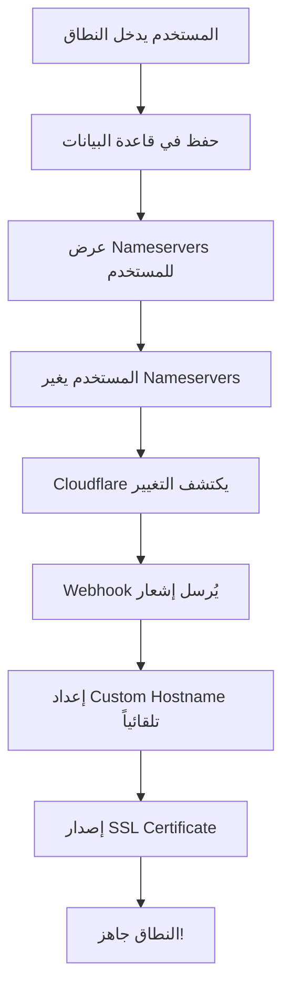

# 🔧 تعليمات إعداد نظام Nameserver - للمطورين

## 🎯 نظرة عامة

هذا الدليل موجه للمطورين والمسؤولين التقنيين لإعداد نظام **Nameserver** الجديد في سطوكيها.

## 📋 متطلبات النظام

### 1. حساب Cloudflare for SaaS
- حساب Cloudflare مع **Zone** نشط
- **Cloudflare for SaaS** مُفعّل
- **Custom Hostnames** متاح

### 2. متغيرات البيئة المطلوبة
```bash
# Cloudflare API
CLOUDFLARE_API_TOKEN=your_cloudflare_api_token
CLOUDFLARE_ZONE_ID=your_zone_id
CLOUDFLARE_PROJECT_NAME=stockiha

# Webhook (اختياري)
CLOUDFLARE_WEBHOOK_SECRET=your_webhook_secret

# Supabase
SUPABASE_URL=your_supabase_url
SUPABASE_SERVICE_ROLE_KEY=your_service_role_key
```

## 🚀 خطوات الإعداد

### الخطوة 1: إعداد Cloudflare Zone

1. **إنشاء Zone في Cloudflare**:
   ```bash
   curl -X POST "https://api.cloudflare.com/client/v4/zones" \
     -H "Authorization: Bearer $CLOUDFLARE_API_TOKEN" \
     -H "Content-Type: application/json" \
     --data '{
       "name": "stockiha.com",
       "type": "full"
     }'
   ```

2. **تفعيل Cloudflare for SaaS**:
   - اذهب إلى Cloudflare Dashboard
   - اختر Zone الخاص بك
   - **SSL/TLS** → **Custom Hostnames**
   - فعّل الخدمة

### الخطوة 2: الحصول على Nameservers

```javascript
// استخدام API الجديد
import { getStockihaNameservers } from '@/api/cloudflare-saas-api';

const result = await getStockihaNameservers();
console.log(result.data.nameservers);
// Output: ['marty.ns.cloudflare.com', 'sue.ns.cloudflare.com']
```

### الخطوة 3: إعداد Webhook (اختياري)

1. **إنشاء Webhook في Cloudflare**:
   ```bash
   curl -X POST "https://api.cloudflare.com/client/v4/accounts/$ACCOUNT_ID/notifications/webhooks" \
     -H "Authorization: Bearer $CLOUDFLARE_API_TOKEN" \
     -H "Content-Type: application/json" \
     --data '{
       "name": "stockiha-domain-webhook",
       "url": "https://your-domain.com/api/cloudflare-webhook",
       "secret": "your_webhook_secret"
     }'
   ```

2. **إعداد Notification Rules**:
   ```bash
   curl -X POST "https://api.cloudflare.com/client/v4/accounts/$ACCOUNT_ID/notifications/policies" \
     -H "Authorization: Bearer $CLOUDFLARE_API_TOKEN" \
     -H "Content-Type: application/json" \
     --data '{
       "name": "Domain Delegation Events",
       "alert_type": "zone_delegated",
       "enabled": true,
       "mechanisms": {
         "webhooks": ["webhook_id_here"]
       }
     }'
   ```

### الخطوة 4: إعداد قاعدة البيانات

```sql
-- إضافة حقول جديدة لجدول domain_verifications
ALTER TABLE domain_verifications ADD COLUMN IF NOT EXISTS ssl_status TEXT;
ALTER TABLE domain_verifications ADD COLUMN IF NOT EXISTS event_type TEXT;
ALTER TABLE domain_verifications ADD COLUMN IF NOT EXISTS verification_errors JSONB;

-- إضافة فهرس للبحث السريع
CREATE INDEX IF NOT EXISTS idx_domain_verifications_domain 
ON domain_verifications(domain);

CREATE INDEX IF NOT EXISTS idx_domain_verifications_org_domain 
ON domain_verifications(organization_id, domain);
```

## 🔄 تدفق العمل

### 1. إضافة النطاق


### 2. التحقق من الحالة
```javascript
// فحص حالة تفويض النطاق
const status = await checkDomainDelegation('example.com');
console.log(status.nameservers_configured); // true/false

// إعداد تلقائي عند اكتمال التفويض
if (status.nameservers_configured) {
  await autoSetupDomain('example.com', 'org_123');
}
```

## 🛠️ أدوات التطوير والاختبار

### 1. اختبار Nameservers
```bash
# فحص Nameservers الحالية
dig NS example.com

# فحص إذا كانت تشير إلى Cloudflare
dig NS example.com | grep cloudflare
```

### 2. اختبار Custom Hostnames
```javascript
// فحص حالة Custom Hostname
const result = await checkCustomHostnameStatus('example.com');
console.log(result.data.status); // 'pending' | 'active' | 'error'
```

### 3. اختبار Webhook
```bash
# محاكاة Webhook event
curl -X POST "https://your-domain.com/api/cloudflare-webhook" \
  -H "Content-Type: application/json" \
  --data '{
    "event_type": "domain_delegated",
    "domain": "example.com",
    "status": "active",
    "timestamp": "2024-01-01T00:00:00Z"
  }'
```

## 📊 مراقبة النظام

### 1. Logs مهمة
```javascript
// في NameserverDomainSettings.tsx
console.log('Domain delegation status:', delegationStatus);

// في cloudflare-webhook.ts
console.log('Processed webhook for domain:', domain);

// في cloudflare-saas-api.ts
console.log('Custom hostname added:', hostname);
```

### 2. Metrics للمراقبة
- عدد النطاقات النشطة
- وقت الإعداد المتوسط
- معدل نجاح الإعداد التلقائي
- أخطاء SSL

## 🚨 استكشاف الأخطاء الشائعة

### المشكلة 1: Nameservers لا تظهر
```javascript
// التحقق من متغيرات البيئة
console.log('CLOUDFLARE_API_TOKEN:', !!process.env.CLOUDFLARE_API_TOKEN);
console.log('CLOUDFLARE_ZONE_ID:', !!process.env.CLOUDFLARE_ZONE_ID);
```

### المشكلة 2: Webhook لا يعمل
```javascript
// التحقق من Webhook endpoint
fetch('/api/cloudflare-webhook', {
  method: 'POST',
  body: JSON.stringify({ test: true })
});
```

### المشكلة 3: Custom Hostname فشل
```javascript
// فحص تفصيلي للأخطاء
const result = await addCustomHostname('example.com', 'org_123');
if (!result.success) {
  console.error('Custom hostname error:', result.error);
}
```

## 📈 تحسينات مستقبلية

### المرحلة 1 (الحالية)
- ✅ نظام Nameserver أساسي
- ✅ إعداد تلقائي للـ Custom Hostnames
- ✅ SSL تلقائي

### المرحلة 2 (المخططة)
- 🔄 إعداد DNS Records تلقائي
- 🔄 دعم Subdomains متعددة
- 🔄 Analytics للنطاقات

### المرحلة 3 (المستقبل)
- 🔄 White-label Nameservers
- 🔄 Multi-zone support
- 🔄 Advanced SSL options

## 📞 الدعم التقني

للمساعدة التقنية:
1. تحقق من logs النظام
2. فحص حالة Cloudflare API
3. تأكد من صحة متغيرات البيئة
4. اختبار Webhook endpoints

---

**ملاحظة**: هذا النظام يتطلب Cloudflare for SaaS المدفوع. تأكد من أن حسابك يدعم Custom Hostnames قبل التفعيل.
