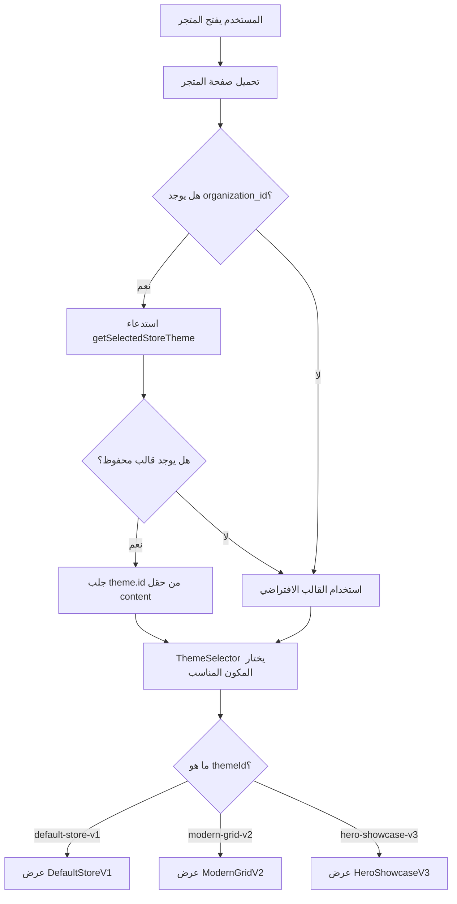

# 📋 دليل تطبيق نظام قوالب المتجر - Store Themes System

## 🎯 المهمة الرئيسية
تطوير نظام ديناميكي لعرض المتجر حسب القالب المختار من قبل المؤسسة في قاعدة البيانات.

---

## 📊 هيكلة قاعدة البيانات

### جدول `organization_templates`

```sql
CREATE TABLE organization_templates (
  id UUID PRIMARY KEY DEFAULT uuid_generate_v4(),
  organization_id UUID NOT NULL REFERENCES organizations(id) ON DELETE CASCADE,
  template_type VARCHAR(50) NOT NULL,  -- نوع القالب
  name VARCHAR(100) NOT NULL,          -- اسم القالب
  content TEXT NOT NULL,               -- محتوى/معرف القالب
  is_default BOOLEAN DEFAULT FALSE,    -- هل هو القالب الافتراضي؟
  created_at TIMESTAMPTZ DEFAULT NOW(),
  updated_at TIMESTAMPTZ DEFAULT NOW()
);
```

### شرح الحقول:

| الحقل | النوع | الوصف | مثال |
|------|------|-------|------|
| `id` | UUID | معرف فريد للسجل (يتم توليده تلقائياً) | `a1b2c3d4-...` |
| `organization_id` | UUID | معرف المؤسسة | `org-uuid-123` |
| `template_type` | VARCHAR(50) | نوع القالب | `STORE_THEME` |
| `name` | VARCHAR(100) | اسم القالب المعروض | `الشبكة العصرية V2` |
| `content` | TEXT | **معرف القالب الفعلي** | `modern-grid-v2` |
| `is_default` | BOOLEAN | القالب المفعّل حالياً | `true` |
| `created_at` | TIMESTAMPTZ | تاريخ الإنشاء | `2025-01-15 10:30:00` |
| `updated_at` | TIMESTAMPTZ | تاريخ آخر تحديث | `2025-01-15 10:30:00` |

### ⚠️ ملاحظات مهمة:
1. **حقل `content`** يحتوي على معرف القالب الفعلي (مثل: `default-store-v1`, `modern-grid-v2`)
2. **حقل `is_default = true`** يحدد القالب النشط حالياً للمؤسسة
3. **`template_type = 'STORE_THEME'`** للتمييز عن أنواع القوالب الأخرى (مثل قوالب الفواتير)

---

## 🗂️ القوالب المتاحة حالياً

### 1️⃣ القالب الافتراضي V1
```javascript
{
  id: 'default-store-v1',
  name: 'التصميم الأساسي V1',
  description: 'تصميم افتراضي يعتمد على مكونات StorePage الحالية.',
  isAvailable: true
}
```

### 2️⃣ الشبكة العصرية V2
```javascript
{
  id: 'modern-grid-v2',
  name: 'الشبكة العصرية V2',
  description: 'تخطيط شبكي عصري مع بطاقات منتجات بارزة.',
  isAvailable: true
}
```

### 3️⃣ عرض البطل V3 (قريباً)
```javascript
{
  id: 'hero-showcase-v3',
  name: 'عرض البطل V3',
  description: 'قسم بطل كبير مع عرض عروض ومجموعات مختارة.',
  isAvailable: false
}
```

---

## 🔌 API Functions الموجودة

### 📂 الموقع: `src/lib/api/organizationTemplates.ts`

### 1. جلب القالب المفعّل
```typescript
export async function getSelectedStoreTheme(
  organizationId: string
): Promise<OrganizationTemplate | null>
```

**الاستخدام:**
```typescript
const selectedTheme = await getSelectedStoreTheme(currentOrganization.id);
// النتيجة:
// {
//   id: "modern-grid-v2",           // معرف القالب من حقل content
//   name: "الشبكة العصرية V2",
//   template_type: "STORE_THEME",
//   is_default: true,
//   content: "modern-grid-v2"
// }
```

### 2. حفظ القالب المختار
```typescript
export async function setSelectedStoreTheme(
  organizationId: string,
  templateId: string,      // مثل: 'modern-grid-v2'
  templateName: string     // مثل: 'الشبكة العصرية V2'
): Promise<boolean>
```

**كيف تعمل:**
1. تلغي `is_default = false` لجميع القوالب الأخرى من نفس المؤسسة
2. تبحث عن سجل موجود بنفس الاسم
3. إذا وجدت: تحدّث `is_default = true`
4. إذا لم تجد: تُنشئ سجل جديد

---

## 🎨 كيفية تطبيق النظام في صفحة المتجر

### الخطوات المطلوبة:

### 1️⃣ إنشاء مكونات القوالب المختلفة

قم بإنشاء مجلد جديد: `src/components/store-themes/`

```
src/components/store-themes/
├── DefaultStoreV1.tsx          # القالب الافتراضي
├── ModernGridV2.tsx            # الشبكة العصرية
├── HeroShowcaseV3.tsx          # عرض البطل (مستقبلاً)
└── ThemeSelector.tsx           # مكون اختيار القالب
```

### 2️⃣ إنشاء مكون اختيار القالب

**📂 `src/components/store-themes/ThemeSelector.tsx`**

```typescript
import React from 'react';
import DefaultStoreV1 from './DefaultStoreV1';
import ModernGridV2 from './ModernGridV2';
import HeroShowcaseV3 from './HeroShowcaseV3';

interface ThemeSelectorProps {
  themeId: string;
  products: any[];
  // أي props أخرى تحتاجها
}

const ThemeSelector: React.FC<ThemeSelectorProps> = ({
  themeId,
  products,
  ...props
}) => {
  switch (themeId) {
    case 'modern-grid-v2':
      return <ModernGridV2 products={products} {...props} />;

    case 'hero-showcase-v3':
      return <HeroShowcaseV3 products={products} {...props} />;

    case 'default-store-v1':
    default:
      return <DefaultStoreV1 products={products} {...props} />;
  }
};

export default ThemeSelector;
```

### 3️⃣ تعديل صفحة المتجر الرئيسية

**📂 ابحث عن الملف الذي يعرض المتجر (مثل `src/pages/StorePage.tsx` أو مشابه)**

```typescript
import React, { useEffect, useState } from 'react';
import { useTenant } from '@/context/TenantContext';
import { getSelectedStoreTheme } from '@/lib/api/organizationTemplates';
import ThemeSelector from '@/components/store-themes/ThemeSelector';

const StorePage: React.FC = () => {
  const { currentOrganization } = useTenant();
  const [selectedThemeId, setSelectedThemeId] = useState<string>('default-store-v1');
  const [products, setProducts] = useState([]);
  const [loading, setLoading] = useState(true);

  useEffect(() => {
    const loadTheme = async () => {
      if (!currentOrganization?.id) {
        setSelectedThemeId('default-store-v1');
        return;
      }

      try {
        const theme = await getSelectedStoreTheme(currentOrganization.id);
        if (theme?.id) {
          setSelectedThemeId(theme.id);
        } else {
          setSelectedThemeId('default-store-v1');
        }
      } catch (error) {
        console.error('خطأ في تحميل القالب:', error);
        setSelectedThemeId('default-store-v1');
      }
    };

    loadTheme();
  }, [currentOrganization?.id]);

  useEffect(() => {
    // تحميل المنتجات هنا
    // setProducts(...)
    // setLoading(false)
  }, []);

  if (loading) {
    return <div>جاري التحميل...</div>;
  }

  return (
    <div className="store-page">
      <ThemeSelector
        themeId={selectedThemeId}
        products={products}
      />
    </div>
  );
};

export default StorePage;
```

### 4️⃣ تصميم القالب: الشبكة العصرية V2

**📂 `src/components/store-themes/ModernGridV2.tsx`**

```typescript
import React from 'react';
import { Card, CardContent, CardHeader, CardTitle } from '@/components/ui/card';
import { Badge } from '@/components/ui/badge';
import { Button } from '@/components/ui/button';

interface ModernGridV2Props {
  products: any[];
}

const ModernGridV2: React.FC<ModernGridV2Props> = ({ products }) => {
  return (
    <div className="modern-grid-v2 container mx-auto px-4 py-8">
      {/* Header Section */}
      <div className="mb-8 text-center">
        <h1 className="text-4xl font-bold mb-2">متجرنا</h1>
        <p className="text-muted-foreground">اكتشف منتجاتنا المميزة</p>
      </div>

      {/* Featured Section - عرض المنتجات المميزة */}
      <div className="mb-12">
        <h2 className="text-2xl font-bold mb-6">منتجات مميزة</h2>
        <div className="grid grid-cols-1 md:grid-cols-2 lg:grid-cols-4 gap-6">
          {products.slice(0, 4).map((product) => (
            <Card
              key={product.id}
              className="hover:shadow-lg transition-shadow duration-300 overflow-hidden group"
            >
              {/* صورة المنتج */}
              <div className="aspect-square overflow-hidden bg-muted relative">
                {product.image_url ? (
                  
                ) : (
                  <div className="w-full h-full bg-gradient-to-br from-primary/10 to-secondary/10 flex items-center justify-center">
                    <span className="text-4xl">📦</span>
                  </div>
                )}

                {/* شارة الخصم إذا وجد */}
                {product.discount && (
                  <Badge className="absolute top-2 right-2 bg-red-500">
                    خصم {product.discount}%
                  </Badge>
                )}
              </div>

              <CardHeader>
                <CardTitle className="text-lg line-clamp-2">
                  {product.name}
                </CardTitle>
              </CardHeader>

              <CardContent>
                <div className="flex items-center justify-between mb-4">
                  <div>
                    {product.discount ? (
                      <>
                        <span className="text-2xl font-bold text-primary">
                          {product.discounted_price} دج
                        </span>
                        <span className="text-sm line-through text-muted-foreground ml-2">
                          {product.price} دج
                        </span>
                      </>
                    ) : (
                      <span className="text-2xl font-bold text-primary">
                        {product.price} دج
                      </span>
                    )}
                  </div>
                </div>

                <Button className="w-full" variant="default">
                  أضف إلى السلة
                </Button>

                {/* معلومات إضافية */}
                <div className="mt-3 flex items-center justify-between text-sm text-muted-foreground">
                  <span>متوفر: {product.stock}</span>
                  {product.rating && (
                    <span className="flex items-center">
                      ⭐ {product.rating}
                    </span>
                  )}
                </div>
              </CardContent>
            </Card>
          ))}
        </div>
      </div>

      {/* All Products Grid - شبكة جميع المنتجات */}
      <div>
        <h2 className="text-2xl font-bold mb-6">جميع المنتجات</h2>
        <div className="grid grid-cols-2 md:grid-cols-3 lg:grid-cols-5 gap-4">
          {products.slice(4).map((product) => (
            <Card
              key={product.id}
              className="hover:shadow-md transition-shadow duration-200"
            >
              {/* صورة مصغرة */}
              <div className="aspect-square overflow-hidden bg-muted">
                {product.image_url ? (
                  
                ) : (
                  <div className="w-full h-full bg-gradient-to-br from-primary/10 to-secondary/10 flex items-center justify-center">
                    <span className="text-2xl">📦</span>
                  </div>
                )}
              </div>

              <CardContent className="p-3">
                <h3 className="font-semibold text-sm line-clamp-2 mb-2">
                  {product.name}
                </h3>
                <p className="text-primary font-bold text-lg">
                  {product.price} دج
                </p>
              </CardContent>
            </Card>
          ))}
        </div>
      </div>
    </div>
  );
};

export default ModernGridV2;
```

### 5️⃣ القالب الافتراضي V1

**📂 `src/components/store-themes/DefaultStoreV1.tsx`**

```typescript
import React from 'react';

interface DefaultStoreV1Props {
  products: any[];
}

const DefaultStoreV1: React.FC<DefaultStoreV1Props> = ({ products }) => {
  return (
    <div className="default-store-v1">
      {/* استخدم المكونات الحالية من StorePage */}
      {/* أو أنشئ نسخة بسيطة */}
      <div className="container mx-auto px-4 py-6">
        <h1 className="text-3xl font-bold mb-6">المتجر</h1>

        <div className="grid grid-cols-1 md:grid-cols-3 lg:grid-cols-4 gap-4">
          {products.map((product) => (
            <div
              key={product.id}
              className="border rounded-lg p-4 hover:shadow-lg transition-shadow"
            >
              <div className="aspect-square bg-muted rounded mb-3">
                {product.image_url && (
                  
                )}
              </div>
              <h3 className="font-semibold mb-2">{product.name}</h3>
              <p className="text-primary font-bold">{product.price} دج</p>
            </div>
          ))}
        </div>
      </div>
    </div>
  );
};

export default DefaultStoreV1;
```

---

## 🔄 آلية عمل النظام



---

## 🗃️ مثال على البيانات في قاعدة البيانات

### سيناريو 1: مؤسسة تستخدم الشبكة العصرية V2

```sql
-- الصف في الجدول:
id: 'a1b2c3d4-e5f6-7890-abcd-ef1234567890'
organization_id: 'org-xyz-123'
template_type: 'STORE_THEME'
name: 'الشبكة العصرية V2'
content: 'modern-grid-v2'              ← المعرف الحقيقي للقالب
is_default: true                        ← القالب النشط
created_at: '2025-01-15 10:00:00'
updated_at: '2025-01-15 10:00:00'
```

### سيناريو 2: مؤسسة تستخدم القالب الافتراضي

```sql
id: 'b2c3d4e5-f6g7-8901-bcde-fg2345678901'
organization_id: 'org-abc-456'
template_type: 'STORE_THEME'
name: 'التصميم الأساسي V1'
content: 'default-store-v1'            ← المعرف الحقيقي للقالب
is_default: true
created_at: '2025-01-14 15:30:00'
updated_at: '2025-01-14 15:30:00'
```

---

## ✅ Checklist التطبيق

### المرحلة 1: الإعداد
- [ ] إنشاء مجلد `src/components/store-themes/`
- [ ] إنشاء ملف `ThemeSelector.tsx`
- [ ] إنشاء ملف `DefaultStoreV1.tsx`
- [ ] إنشاء ملف `ModernGridV2.tsx`

### المرحلة 2: التطبيق
- [ ] استيراد `getSelectedStoreTheme` في صفحة المتجر
- [ ] إضافة `useState` لحفظ `themeId`
- [ ] إضافة `useEffect` لجلب القالب المختار
- [ ] استبدال العرض الثابت بـ `ThemeSelector`

### المرحلة 3: التصميم
- [ ] تصميم واجهة `ModernGridV2` حسب المواصفات
- [ ] إضافة Hover Effects
- [ ] إضافة Responsive Design
- [ ] إضافة Loading States

### المرحلة 4: الاختبار
- [ ] اختبار القالب الافتراضي
- [ ] اختبار الشبكة العصرية V2
- [ ] اختبار التبديل بين القوالب
- [ ] اختبار الحالة عند عدم وجود قالب محفوظ

---

## 🎨 نصائح التصميم

### للقالب "الشبكة العصرية V2":
1. **الألوان**: استخدم نظام الألوان من `tailwind.config`
2. **المسافات**: استخدم spacing متسق (4, 6, 8, 12)
3. **الانتقالات**: أضف `transition-*` للتفاعلية
4. **الصور**: استخدم `aspect-square` للحفاظ على نسب موحدة
5. **الخطوط**: استخدم الأحجام: `text-4xl`, `text-2xl`, `text-lg`

### Responsive Breakpoints:
```css
mobile:   grid-cols-1 (افتراضي)
md:       grid-cols-2 أو grid-cols-3
lg:       grid-cols-4 أو grid-cols-5
```

---

## 🐛 Troubleshooting

### المشكلة: القالب لا يتغير
✅ **الحل**: تأكد من:
1. `currentOrganization.id` موجود
2. `getSelectedStoreTheme` يعيد البيانات الصحيحة
3. `themeId` يطابق أحد القيم في `ThemeSelector`

### المشكلة: خطأ في قاعدة البيانات
✅ **الحل**: تأكد من:
1. حقل `content` يحتوي على قيمة (ليس `null` أو فارغ)
2. `is_default` صحيح لسجل واحد فقط لكل مؤسسة
3. `template_type = 'STORE_THEME'`

### المشكلة: المنتجات لا تظهر
✅ **الحل**: تأكد من:
1. تمرير `products` بشكل صحيح للمكون
2. البيانات محمّلة قبل عرض `ThemeSelector`
3. فحص console للأخطاء

---

## 📞 معلومات إضافية

### الملفات الرئيسية المعنية:
```
src/
├── lib/api/organizationTemplates.ts    ← API Functions
├── pages/dashboard/StoreThemes.tsx     ← إدارة القوالب
├── components/store-themes/            ← مكونات القوالب (ستنشئها)
│   ├── ThemeSelector.tsx
│   ├── DefaultStoreV1.tsx
│   └── ModernGridV2.tsx
└── [صفحة المتجر الرئيسية]             ← ستعدّلها
```

### Dependencies المطلوبة:
- `@/components/ui/card`
- `@/components/ui/badge`
- `@/components/ui/button`
- `@/context/TenantContext`
- `@/lib/api/organizationTemplates`

---

## 🚀 الخطوات التالية بعد التطبيق

1. **إضافة قالب Hero Showcase V3**
2. **إضافة نظام معاينة القالب قبل التفعيل**
3. **إضافة إعدادات تخصيص لكل قالب (ألوان، خطوط، إلخ)**
4. **إضافة نظام Analytics لتتبع أداء كل قالب**

---

## 📄 الملخص

- **الجدول**: `organization_templates`
- **الحقل المهم**: `content` → يحتوي على `themeId` الحقيقي
- **API Functions**: `getSelectedStoreTheme()`, `setSelectedStoreTheme()`
- **المكونات**: `ThemeSelector` → يختار المكون المناسب حسب `themeId`
- **القوالب الحالية**: `default-store-v1`, `modern-grid-v2`

---

**✨ نهاية الدليل - حظاً موفقاً في التطبيق! ✨**
